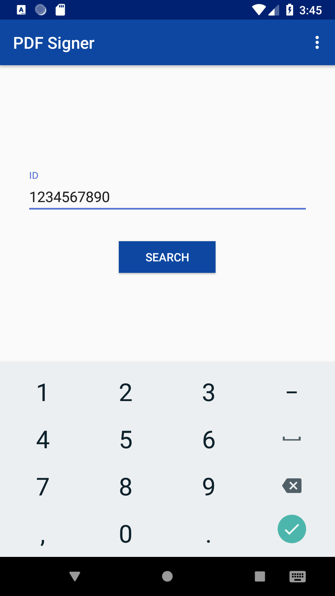
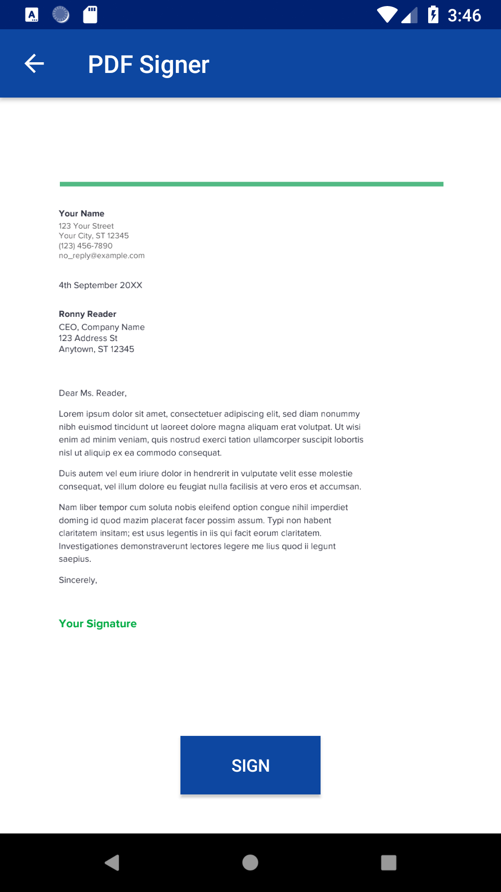
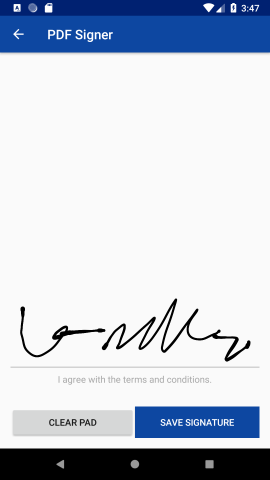
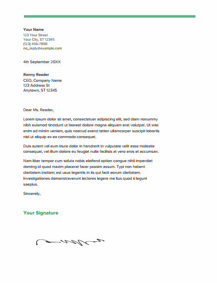
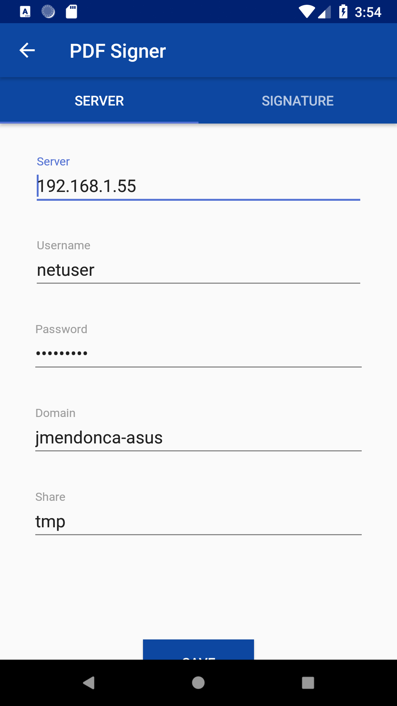
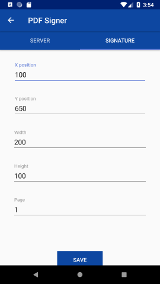

# Android PDF Signer
Android PDF Signer is an Android App written in Java that:
- given an id, grabs a pdf from a network share to local storage;
- captures the signature using an on screen signature pad; 
- appends the captured signature to the pdf; 
- saves the resulting pdf to the network share;

## Installation

Clone the project from github:
```sh
git clone https://github.com/zhoorta/android-pdf-signer.git
```
Open the project with Android Studio (recommended).

## Usage

The app uses a network share (currently only SMB/Samba shares) to grab original (in folder) and save resulting pdfs (out folder). To be used it is necessary to configure the SMB share access with: server, username, password, domain and sharename.

In the main activity the user inputs an ID. The app then searches for a file with the name **ID.pdf** on the in folder. If found opens the file for preview. Choosing the option to sign, the app opens a signature pad to capture the signature. When saving, appends the signature to the pdf using a configured width, height, page and position on the pdf document. The document is then saved on the out folder of the network share.

## Libraries

- [smbj] (https://github.com/hierynomus/smbj) for SMB access;
- [PdfBox-Android] (https://github.com/TomRoush/PdfBox-Android) for appending signature to pdf;
- [AndroidPdfViewer] (https://github.com/barteksc/AndroidPdfViewer) to display the pdf;
- [android-signaturepad] https://github.com/gcacace/android-signaturepad) to capture the signature;

## Screenshots

 | 
 | 
 | 

## Todo

- Add other type of file shares/cloud storage like Amazon S3
- ...
